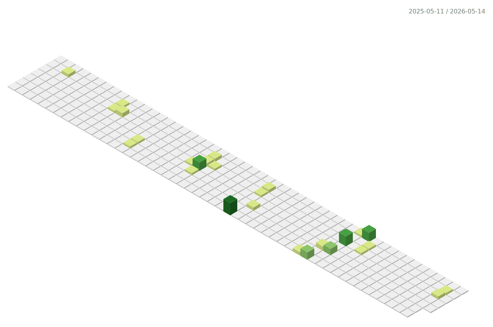

<div align="center">


<br>

<a href="https://github.com/kylefischer">
  
</a>
<a href="https://github.com/kylefischer?tab=repositories">
  
</a>

<br><br>

<a href="https://linkedin.com/in/kylepfischer">
  
</a>
<a href="mailto:kylefischer@berkeley.edu">
  
</a>

<br><br>


</div>

<br>

```sql
/*
 * =============================================
 *   $ whoami → kyle_fischer
 *   @ Berkeley School of Education CoRE Lab
 *   @ Haas School of Business, UC Berkeley
 * =============================================
 */

SELECT *
FROM   about_me
WHERE  role = 'Data Scientist'
AND    university = 'UC Berkeley';

-- ┌──────────────────────────────────────────────────────────┐
-- │  RESULT SET: 1 row returned                             │
-- ├──────────────────────────────────────────────────────────┤
-- │  name       : Kyle Fischer                              │
-- │  degree     : B.A. Cognitive Science, Minor Data Science │
-- │  location   : Berkeley, CA                              │
-- │  focus      : ML · NLP · Statistical Modeling · Pipelines│
-- └──────────────────────────────────────────────────────────┘

SELECT   skill, proficiency
FROM     technical_skills
ORDER BY proficiency DESC;

-- LANGUAGES
-- ─────────────────────────────
-- Python          ████████████  expert
-- SQL (Postgres)  ████████████  expert
-- JavaScript      ████████░░░░  advanced
-- R               ███████░░░░░  advanced
-- Java            ██████░░░░░░  proficient
-- HTML/CSS        ██████░░░░░░  proficient

-- FRAMEWORKS & TOOLS
-- ─────────────────────────────
-- Pandas          ████████████  expert
-- Scikit-Learn    ███████████░  expert
-- NumPy           ███████████░  expert
-- TensorFlow      ████████░░░░  advanced
-- HuggingFace     ████████░░░░  advanced
-- Matplotlib      ████████████  expert
-- Beautiful Soup  ███████░░░░░  advanced
-- FastAPI         ██████░░░░░░  proficient
-- Jupyter         ████████████  expert

SELECT   project_name,
         stack,
         description
FROM     projects
ORDER BY cool_factor DESC;

-- ┌─────────────────────────────────────────────────────────────────────┐
-- │ Brawl Stars Analytics Dashboard                                    │
-- │ Python · Pandas · NumPy · Streamlit · Plotly · Brawlstats API      │
-- │ Real-time analytics dashboard processing 25+ matches per user,     │
-- │ with EDA, metric generation, and interactive visualizations.       │
-- ├─────────────────────────────────────────────────────────────────────┤
-- │ Spotify Taste Profiler                                             │
-- │ Python · Pandas · Matplotlib · Scikit-learn · Spotipy API          │
-- │ Unsupervised learning pipeline using K-means clustering to model   │
-- │ user listening behavior across 300 top tracks per user.            │
-- └─────────────────────────────────────────────────────────────────────┘

SELECT   role, organization, highlight
FROM     experience
WHERE    status = 'building cool stuff';

-- ┌─────────────────────────────────────────────────────────────────────┐
-- │ Undergraduate Research Data Scientist                              │
-- │ Berkeley School of Education CoRE Lab                              │
-- │ NLP pipeline with SBERT embeddings across 300+ course descriptions │
-- ├─────────────────────────────────────────────────────────────────────┤
-- │ Data Analyst                                                       │
-- │ Haas School of Business, UC Berkeley                               │
-- │ Entity-resolution algorithms achieving 95%+ precision on 10M+ rows│
-- └─────────────────────────────────────────────────────────────────────┘

-- EOF. Thanks for reading my database. ─── Kyle Fischer © 2026
```

<br>

<div align="center">

<h2>🔧 Languages & Tools</h2>


<br>


<br>


</div>

<br>

<div align="center">

<h2>📊 GitHub Stats</h2>


<a href="https://git.io/streak-stats">
  
</a>

<br>


</div>

<br>

<div align="center">

<h2>🧊 3D Contributions</h2>

<picture>
  <source media="(prefers-color-scheme: dark)" srcset="./profile-3d-contrib/profile-green-animate.svg" />
  <source media="(prefers-color-scheme: light)" srcset="./profile-3d-contrib/profile-green-animate.svg" />
  
</picture>

</div>

<br>


